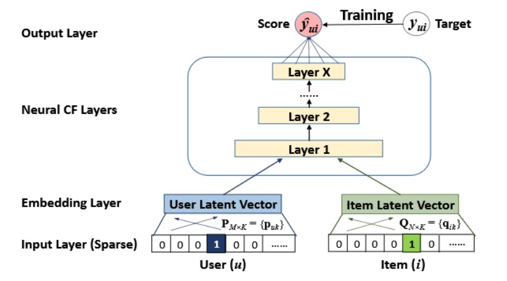

# CollaborativeFilteringResearch

## The Computational Overhead of Differentially Private Collaborative Filtering Systems 
## Ryan Leigh 
## Arizona State University, rleigh2@asu.edu 

To run, simply just run in any python 3.11 intepretor or later using jupyter notebook. Data is sourced from MovieLens.

Diagram of Model Architecture (He, Xiangnan, et al)